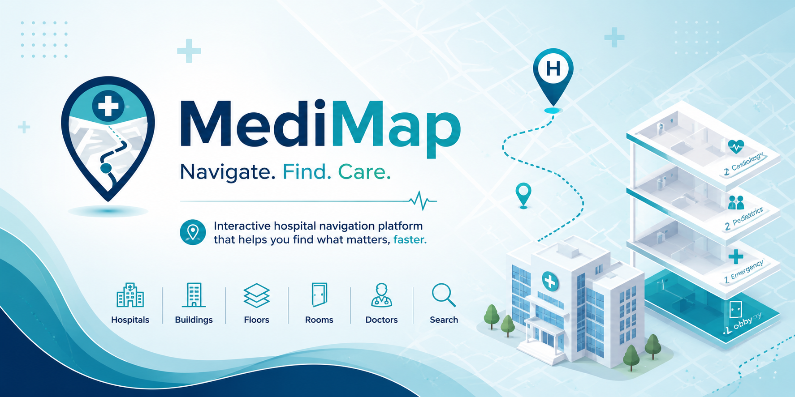

  

<h1 align="center"> MediMap</h1>

  <strong>Navigate. Find. Care.</strong>

An interactive hospital navigation platform that helps patients quickly find hospitals, buildings, departments, doctors and rooms.

##  What is MediMap?

MediMap is an interactive web platform designed to simplify navigation inside hospitals.

After selecting a hospital, users can explore its internal structure through interactive floor maps and quickly find buildings, departments, doctors and rooms—all from a single, intuitive interface.

Whether visiting a hospital for the first time or returning for an appointment, MediMap helps users reach their destination quickly and with confidence.

---

##  The Problem

Hospitals are often large and complex, consisting of multiple buildings, floors, departments and hundreds of rooms. Patients and visitors frequently struggle to find the correct destination, especially in unfamiliar hospitals.

As a result:

- Patients waste valuable time searching for the right location.
- Visitors often become confused or stressed.
- Appointments may be delayed because people cannot find the correct room.
- Hospital staff spend a significant amount of time providing directions instead of focusing on patient care.

---

##  The Solution

MediMap provides every hospital with its own interactive digital navigation platform.

Users simply select a hospital and can instantly:

-  Browse all hospital buildings
-  Explore every floor through interactive maps
-  View departments
-  Find doctors and their assigned departments
-  Locate rooms
-  Search information from one place

Everything is accessible through a modern, mobile-friendly web application, making hospital navigation faster, easier and more intuitive.

---

##  Key Features

-  Hospital selection
-  Building overview
-  Interactive floor maps
-  Department directory
-  Doctor directory
-  Room information
-  Fast search
-  English & Romanian support
-  Responsive design

---

##  Our Mission

Our mission is to improve the hospital experience by making navigation simple, accessible and stress-free.

MediMap helps patients and visitors spend less time searching for their destination and more time focusing on what truly matters—their healthcare.
